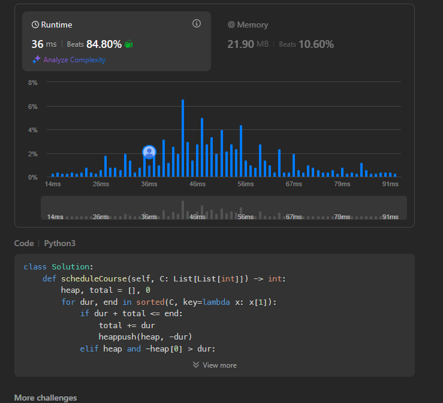
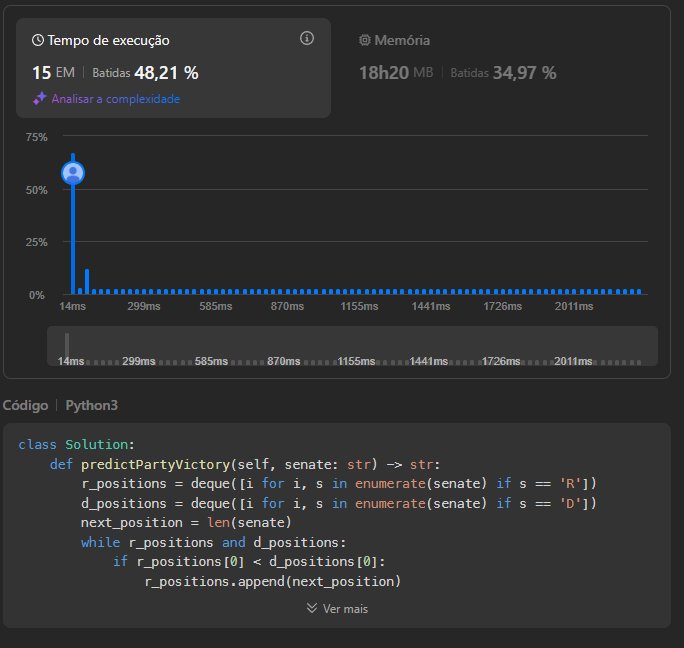
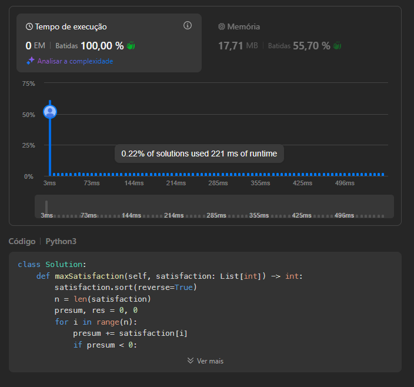

# Greedy_LeetCodee
Temas:
 - Algoritmos Ambiciosos - link do video : https://youtu.be/QE_43SQeaO0
# NomedoProjeto

**Conteúdo da Disciplina**: Algoritmos Ambiciosos 

## Alunos
|Matrícula | Aluno |
| -- | -- |
| 19/0039116 |  Vinicius Alves Freitas Livramento |

## Questões 

|Questão | Nível |
| -- | -- |
| [630. Course Schedule III](https://leetcode.com/problems/course-schedule-iii/description/?envType=problem-list-v2&envId=greedy)  |  Difícil |
| [649. Dota2 Senate](https://leetcode.com/problems/dota2-senate/description/?envType=problem-list-v2&envId=greedy)  |  Médio |
| [1402. Reducing Dishes](https://leetcode.com/problems/reducing-dishes/description/?envType=problem-list-v2&envId=greedy) |  Difícil |

## Sobre 
Realização de exercícios da plataforma de juiz eletrônico LeetCode

## Screenshots
### Problema 630

### Problema 649

## Problema 1402

## Instalação 
**Linguagem**: Python 

